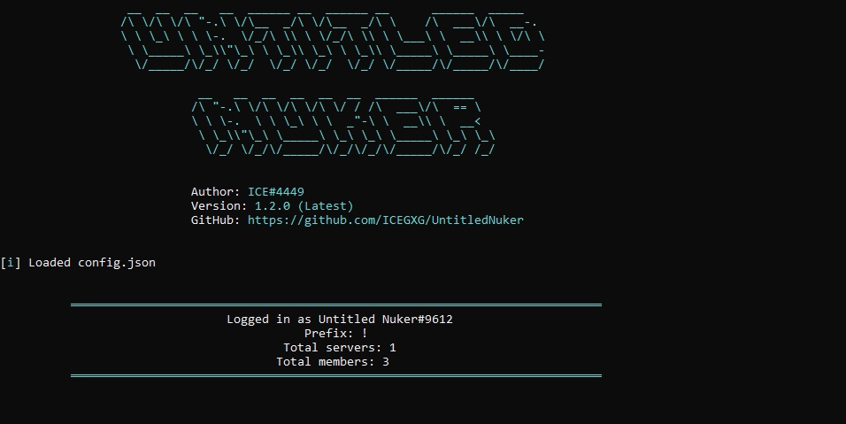

<div id="top"></div>
<p align="center">


</p>
<p align="center">
  <a href="https://github.com/othneildrew/Best-README-Template">
    
  </a>
  
  <h3 align="center">Multifunctional bot for destroying discord servers</h3>
  <p align="center">
    <br />
    <a href="https://github.com/ICEGXG/UntitledNuker"><strong>Explore the docs »</strong></a>
    <br />
    <br />
    <a href="https://github.com/ICEGXG/UntitledNuker/issues">Report Bug</a>
    ·
    <a href="https://github.com/ICEGXG/UntitledNuker/issues">Request Feature</a>
  </p>
</p>

<details>
  <summary>Table of Contents</summary>
  <ol>
    <li>
      <a href="#about-the-project">About The Project</a>
    </li>
    <li>
      <a href="#getting-started">Getting Started</a>
      <ul>
        <li><a href="#prerequisites">Prerequisites</a></li>
          <ul>
            <li><a href="#how-to-create-bot-account">How to create bot account</a></li>
            <li><a href="#how-to-enable-intents">How to enable intents</a></li>
          </ul>
        <li><a href="#installation">Installation</a></li>
      </ul>
    </li>
    <li><a href="#changelog">Changelog</a></li>
    <li><a href="#usage">Usage</a></li>
    <li><a href="#license">License</a></li>
    <li><a href="#contact">Contact</a></li>
  </ol>
</details>

## About Untitled Nuker



Untitled Nuker is multifunctional and feature-rich bot for destroying discord servers

### Features:
* `Nuke Server`
* `Ban Everyone`
* `Kick Everyone`
* `Rename Everyone`
* `DM Everyone`
* `Spam To All Channels`
* `Delete All Channels`
* `Delete All Roles`
* `Spam With Channels`
* `Spam With Roles`
* `Edit Server Icon`
* `Edit Server Name`  
* `Get Admin Role`
* `Custom activity`
* `Whitelisting`
* `And some more features`

<p align="right">(<a href="#top">back to top</a>)</p>

## Getting Started
To get a local copy up and running follow these simple steps.

### Prerequisites
1. You need to install Python, you can donwnload it [here](https://www.python.org)
2. You need discord bot account with intents enabled
    #### How to create bot account:
    1. Make sure you're logged on to the [Discord website](https://discord.com).
    2. Navigate to the [application page](https://discord.com/developers/applications).
    3. Click on the "New Application" button.  
    4. Give the application a name and click "Create".  
    5. Create a Bot User by navigating to the "Bot" tab and clicking "Add Bot".
        * Click "Yes, do it!" to continue.  
    6. If you want others to be able to invite your bot tick the **Public Bot**. Keeping it unticked will prevent others from inviting your bot to their servers and only you will be able to add the bot to servers (provided that you have needed permissions in the server you want to add the bot to).
        * Make sure **Require OAuth2 Code Grant** is unchecked.  
    7. Copy the token using the "Copy" button.
    #### How to enable intents:
    1. Navigate to the [application page](https://discord.com/developers/applications).
    2. Click on the bot you want to enable privileged intents for.
    3. Navigate to the bot tab on the left side of the screen.
    4. Scroll down to the "Privileged Gateway Intents" section, enable all privileged intents and save your changes.

### Installation
If you use windows, you can simply run UntitledNuker.exe  
Or you can follow next steps:
1. Clone the repo
   ```sh
   git clone https://github.com/ICEGXG/UntitledNuker
   ```
2. Move to the source directory:
   ```sh
   cd UntitledNuker/src
   ```
3. Install Python packages
   ```sh
   pip install -r requirements.txt
   ```
<p align="right">(<a href="#top">back to top</a>)</p>

## Usage
Run the `UntitledNuker.py` file using `py -3 UntitledNuker.py`, or run `UntitledNuker.exe`  
At the first launch bot will ask you for:
   1. Bot token
   2. Prefix
   3. Owner's discord ID  
   4. Whitelist enabling

Next times bot will run immediately.  
After starting you can use the !help command (Change `!` to your prefix), being on the same server as the bot (Or into PM). Bot will send you all the available commands.
<p align="right">(<a href="#top">back to top</a>)</p>

## Changelog (1.3.1)
* Fixed error when launching using source code
* Added option to enable/disable logging via discord.py
* Removed useless parts of the code
<p align="right">(<a href="#top">back to top</a>)</p>

## License
Distributed under the MIT License. See [LICENSE.txt](LICENSE.txt) for more information.  
Use for educational purposes only
<p align="right">(<a href="#top">back to top</a>)</p>

## Contact
Project Link: [https://github.com/ICEGXG/UntitledNuker](https://github.com/ICEGXG/UntitledNuker)  
  
<p align="right">(<a href="#top">back to top</a>)</p>
